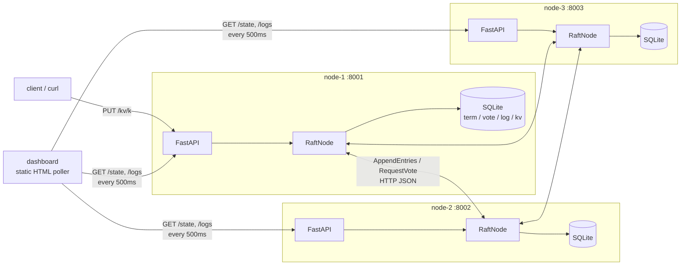
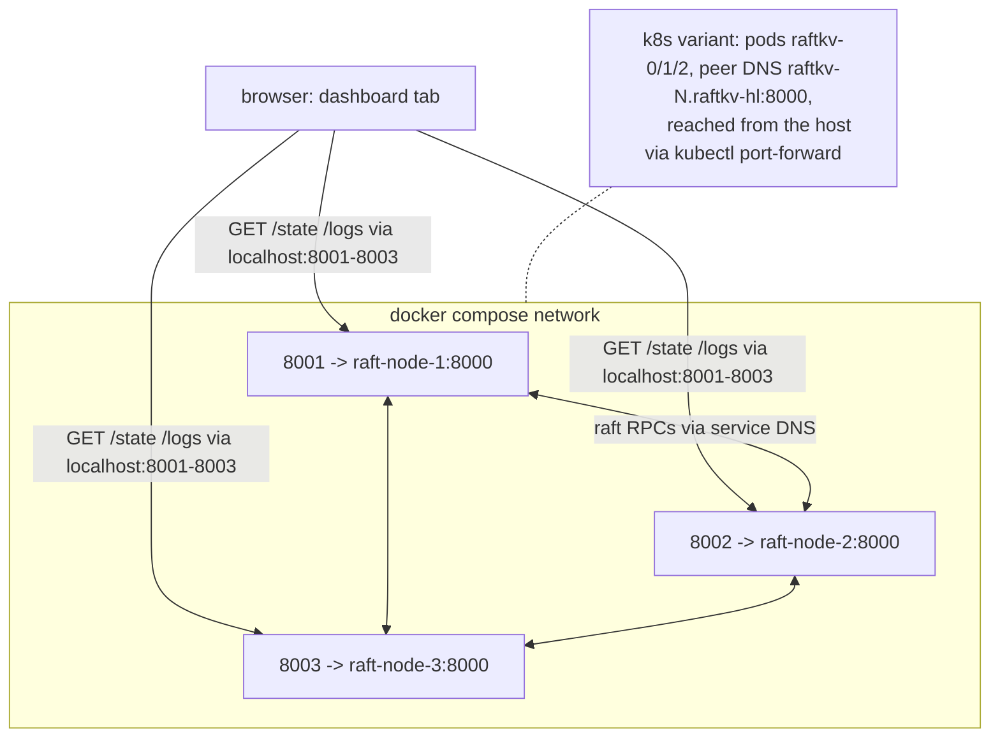

# Architecture

Three identical FastAPI processes form a Raft cluster over HTTP/JSON. Every module below
is a separate unit because it has exactly one owner-responsibility and a small, typed
interface — which is also what makes the layers testable in isolation.

## Modules

### `models.py`
Owns every shared Pydantic shape: `Command`, `LogEntry`, the four RPC
request/response models, `Metrics`, and `NodeState` (the `/state` payload — the
dashboard's entire world view of one node). It exists separately so that the wire
protocol, the storage layer, and the API all validate against one source of truth;
nothing else defines a data shape.

### `config.py`
Owns `NodeConfig` and `NodeConfig.from_env()`: node id, peer map, DB path, log dir, and
the four timing knobs (`heartbeat_interval` 0.5 s, election timeout 1.5–3 s,
`rpc_timeout`, `commit_timeout`). A model validator rejects nonsensical timing
(inverted timeout range, heartbeat slower than election, RPC timeout eating the
liveness margin) at startup rather than as a mystery election storm once running.

### `logging_setup.py`
Owns observability plumbing: a `JsonFormatter`, a `RotatingFileHandler` (1 MB × 5
files), and a `RingBufferHandler` whose recent records back `GET /logs` — the
dashboard merges every node's feed into one centralized view. `log_event()` is the
single logging entry point and **refuses any `value` in its context** (PII policy:
keys and metadata only, never KV values), enforced by
`tests/test_logging_setup.py::test_log_event_refuses_pii_value`.

### `storage.py`
Owns the single SQLite file per node: Raft persistent state (`current_term`,
`voted_for`, `log[]`) **and** the applied KV state machine. It is separate because
Raft's correctness depends on what is durable when — see the schema section below.
Interface: `load`/`save_term_and_vote`, log reads (`last_log_index`, `term_at`,
`entry`, `entries_from`), `append`, `truncate_from`, and `apply` (KV write + advance
`last_applied` in one transaction). `entries_from` takes a `limit` and pushes it into the
SQL rather than slicing the result: a leader 3000 entries ahead of a follower should not
decode 3000 rows into pydantic models to send 512 of them, once per round, per peer.

### `transport.py`
Owns how RPCs travel. `Transport` is a `Protocol` with `request_vote` /
`append_entries`; `HttpTransport` implements it with a shared `httpx.AsyncClient`
mapping network errors and bad statuses to `TransportError`; `MemoryTransport`
implements it in-process with `crash` / `partition` / `heal` controls. The split is
what lets `test_simulation.py` run real elections over a fake network — the RaftNode
cannot tell the difference.

### `raft.py`
Owns the algorithm. `RaftNode` has synchronous rule methods
(`handle_request_vote`, `handle_append_entries`, `_advance_commit_index`,
`_observe_term`, `_become_follower`/`_become_leader`) and three background tasks —
election timer, replication/heartbeat loop, single apply loop — plus async flows
(`_start_election`, `_append_to_peer`, `submit`). It knows nothing about HTTP or
FastAPI: it talks to a `Transport` and a `Storage`.

`_check_quorum` and `_straw_poll` are the other pair, and the same warning applies: neither
is safe to ship without the other. CheckQuorum (thesis §6.2) makes a leader resign once a
majority has stopped answering, because Raft only ever deposes a leader by message and a
partitioned one receives none. But resigning turns a quiet stale leader into a candidate,
and a candidate that can never reach a quorum burns a term per election timeout — so it
rejoins tens of terms ahead and deposes a leader that was serving fine. PreVote (thesis
§9.6) closes that: a node polls for the term it *would* run in, incrementing and persisting
nothing, and stays a follower unless a majority encourages it. Together they read: step
down when you cannot lead, stay silent while you cannot win. `/admin/campaign` skips the
poll deliberately, exactly as TimeoutNow does (thesis §3.10) — a leadership transfer is the
operator deposing a healthy leader on purpose, which is the one thing the poll refuses.

`MAX_ENTRIES_PER_APPEND` (512) bounds one `AppendEntries`, and it is half of a pair. The
batch used to be everything outstanding, to every follower, every round — measured at 2000
pending: ~195 KiB per peer and ~33 ms of loop time per round across four of them, paid
again on the next round until the burst drained. But a cap on its own converts catch-up
into one batch per *heartbeat*, which is the slow repair §5.3 was added to remove. So a
successful append that leaves the peer still behind sets `_replicate_now` and the next
round starts at once; only a successful one, or an unreachable peer would spin the loop at
CPU speed. The number is a payload budget (roughly 50 KiB a message), not a tuning dial.

### `app.py`
Owns the HTTP surface: `create_app()` (uvicorn `--factory`) wires config → logging →
storage → transport → `RaftNode` inside a `lifespan` context. Endpoints: the two Raft
RPCs, the KV API (`PUT`/`GET`/`DELETE /kv/{key}`), `GET /state`, `GET /logs`,
`GET /healthz`, `GET /build`, and `/` serving the dashboard. Exception handlers translate
`NotLeaderError` → **503 + `leader_id`**, commit `TimeoutError` → 504, validation →
422, everything else → a structured 500.

### `build.py`
Owns the two build stamps, and they are two rather than one because the layers reload
differently: `ui_build()` hashes `dashboard.html` and is **recomputed per request**
(`GET /` re-reads the file, so an HTML edit is live on reload), while `SERVER_BUILD`
hashes `raftkv/*.py` and is **frozen at import** (Python is imported once per process, so
a `.py` edit does nothing until restart). The frozen one therefore names the code
*executing*, not the code on disk — which is the only way a node can report that it is
running something stale. Both are content hashes, so neither can drift from what it
describes. Served by `GET /build`, which answers even while crashed.

### `flood.py`
Owns the server-side load generator behind the dashboard's flood control. It lives in the
server rather than a shell script because the interesting failure is a *concurrency*
failure, and a browser's own connection pool becomes the bottleneck you would be
measuring. Every write goes through `RaftNode.submit()` — the same call the HTTP handler
makes — so the path under load is the real one. Three workloads (`distinct`, `overwrite`,
`mixed`) because they fail differently. A demo affordance on the same footing as
`/admin/crash`: unauthenticated and gated by `RAFT_ADMIN_ENABLED`, since an open endpoint
that makes a cluster do unbounded work is a denial-of-service switch.

**Every write settles into a counter, and the worker raises nothing but
`CancelledError`.** This is load-bearing rather than defensive habit: `asyncio.gather`
propagates the first exception and abandons every task queued behind it, so one
unexpected error used to strand `done` below `total` for the rest of the run. The four
counters partition `done` exactly — `ok`, `timeout`, `not_leader` and `failed` — and the
first three are Raft under strain while `failed` is a bug in this build. The dashboard
tints them differently for that reason. See [FAILURE_MODES.md](FAILURE_MODES.md).

### `static/dashboard.html`
One static page, vanilla JS and Canvas 2D, zero dependencies and zero build step. It
polls every node's `/state` and `/logs` every 500 ms. Polling (not WebSockets) is
deliberate: when a node dies the poll fails and the node goes red — the failure mode *is*
the feature.

**Which node is "the leader".** During a partition more than one node self-reports
`role=leader` and both are telling the truth: Raft guarantees one leader *per term*, not
one leader. `leaderEntry()` therefore picks the **highest term**, and the header chip, the
topology edges and every write the control panel sends all read through it. Picking the
first match in address order instead — which is what this did originally — routes
control-panel writes to a stale leader that cannot commit them. See
[FAILURE_MODES.md](FAILURE_MODES.md) and `tests/test_dashboard_leader.py`.

**The load generator panel.** Start, stop, and three numbers: workload, how many writes,
and how many at once. The last of those is the one worth varying — the same
total commits cleanly in small batches and can starve the heartbeat in one big one, and
having both on the same control is what turns the throughput ceiling from an assertion
into something observable.

The flood runs *inside the leader*, so the panel is a remote control and a progress
display, nothing more. Two consequences shape it. It names the node it is polling rather
than silently following the current leader: a flood keeps reporting from whichever node
started it, and re-pointing at the new leader after a mid-flood election would make the
counters look like they had reset. And because `POST /admin/flood` returns immediately,
every bit of progress arrives through the ordinary 500 ms tick — a synchronous endpoint
would hold the connection for the whole burst and show nothing until it was already over.

The bar is **stacked by outcome**, not a single fill: committed in green, timed out in
amber, rejected in red, each as a share of the total, with the untouched remainder left as
visible track. Which way the writes went is the entire finding, and a monochrome progress
bar would hide it — as would tinting a finished-but-half-timed-out run the same green as a
clean sweep, which is why the summary goes amber whenever anything failed. The wording and
the tint are pinned by `tests/test_dashboard_flood.py`, which slices the formatter out of
this file and runs it under node.

**Layout.** Two columns, because this page is watched, not read. The left column carries
what the cluster is *doing* (topology graph, then a card per node); the right column
carries context and controls that must stay on screen while you act on the left
(system summary, control panel, event feed). Above both, a health strip answers the
four questions an operator asks first — nodes up, quorum, who leads, are writes being
accepted — since none of those is derivable at a glance from three node cards. Below
1100px it collapses to one column.

**Topology graph.** A canvas, redrawn on `requestAnimationFrame`, showing nodes on a
ring with edges from the leader outward. Only leader-to-peer edges are drawn because
that is the only direction data flows in Raft; a full mesh would be a lie. A cut link
is dashed with an X on the wire, an unreachable node is dashed red. Pulses travelling
along an edge are fired by real `log_appended` events observed in `/logs`, not by an
idle timer — the animation is data, not decoration.

Canvas rather than SVG or WebGL: a handful of nodes reads better flat than in
perspective, and the page must stay offline and dependency-free because it is served
from inside the container. A CDN import would be a regression even if it looked good
on the machine that wrote it.

**Grayscale first.** Hierarchy comes from size, weight and spacing; color is reserved
for semantics only (role, and the three failure states). The page is legible with
color removed, which is the test that keeps color from doing hierarchy's job. Labels
are uniformly small, dim and letter-spaced so values carry the eye.

It polls the literal address `127.0.0.1`, not `localhost`. `localhost` resolves to
either `127.0.0.1` or `::1`, and those can be two different clusters: a local node
binds the specific address `127.0.0.1:8001` while compose publishes the wildcard
`0.0.0.0:8001` *and* `[::]:8001`, so both listen on "port 8001" and DNS decides which
one a tab talks to. Override with `?nodes=host:port,...`.

The event feed is sorted **newest first** — a live feed that appends at the bottom
makes you scroll to find the line that just happened. Events are tinted
by class (replication, election, failure) rather than by node, because what happened
matters more than where when you are following a running cluster.

Each node card shows the four fields that change while the cluster runs, then collapses the
rest into three `<details>` blocks: **infrastructure** (peers and the addresses this
node dials them at, cut links marked), **state machine** (the applied KV), and
**metrics**. It is per-card rather than global because nodes can legitimately disagree
about the topology, and seeing that disagreement is the point. Open/closed state lives
in a JS `Set`, not the DOM, because the cards are rebuilt every 500 ms.

**The state machine block is the one whose length is set by the data**, not by the
design: empty at rest, several hundred rows after a flood. Two consequences. It scrolls
inside a fixed-height box, so a card is the same size either way and the three stay
comparable — unbounded, it grows past the viewport and pushes the topology graph and the
other cards off screen. And its scroll position lives in a `Map` beside the open/closed
`Set`, for the same reason: `renderNodes()` calls `replaceChildren`, so every card is a
brand-new subtree twice a second, and a position that resets on each tick makes a long
list impossible to read at all. `restoreScroll()` therefore runs *after* the attach —
`scrollTop` set on a detached element is silently dropped.

Keys are sorted **numerically**, not by byte order. `storage.kv_all()` is `ORDER BY key`,
so a flood arrives as `k1, k10, k100, k11, k2` and answering "did k80 land" means reading
the whole list. `Intl.Collator("en", {numeric: true})` does this natively — no hand-rolled
parser to get wrong on `k007` vs `k7` — and the locale is pinned rather than left to the
viewer's browser, which would make the order untestable and the output unrepeatable. The
generator additionally zero-pads its own keys to a fixed width (`k0000`, not `k0`) — sized
once from `MAX_TOTAL`, not per run, so that re-running the flood with a different number
overwrites the previous keys instead of leaving a second, differently-padded family the
byte order interleaves. So byte
order and numeric order agree for anyone reading `curl /state | jq` without the dashboard
doing the sorting for them.

Each card also has a **kill** button (**revive** once it is down), posting to
that node's `/admin/crash` and `/admin/recover`. A crashed node keeps its process — so
the revive button stays reachable — but returns 503 from every Raft RPC, `/state`,
`/healthz` and the KV API, so its peers experience an ordinary crash and elect around
it. Recovery reloads term, vote, log and applied KV from SQLite and rejoins as a
follower, which demonstrates the persistence guarantee rather than asserting it. These
endpoints are an unauthenticated demo affordance; `RAFT_ADMIN_ENABLED=0` removes them,
and a real deployment injects failure from the orchestrator instead.

**cut links** / **heal all links** post to `/admin/partition`, which sets the full set
of peers a node cannot reach (replace semantics, so `[]` heals). The cut closes in
both directions: outbound RPCs are skipped in `RaftNode`, inbound ones are refused by
the app layer, because a one-way cut is a delay rather than a partition and makes Raft
look broken in ways real networks rarely are. Blocking counts as an rpc failure rather
than an error, which is exactly what an unreachable peer already looks like from
inside the node.

This is the failure crash-testing cannot show: a partitioned leader stays up, still
green, still calling itself leader, accepts writes, and commits none of them, because
commit needs a majority it can no longer reach. On heal it learns the higher term,
steps down, and its uncommitted suffix is truncated and replaced.

Growing the cluster is **two buttons**, and the split is the design rather than a step
count. `provision.py` (`POST /admin/spawn-node`) starts an operating-system process and
takes no part in the log; `/admin/add-learner` appends a configuration entry and is
leader-only. Membership is a view over the replicated log, so nothing a process does to
itself can put it in a cluster — only a leader appending can.

**provision node** therefore produces a node that is running and in nobody's
configuration: a learner with no peers, so an empty voter set, which never campaigns and
which nothing replicates to. Ordinals start at 4 and walk upward to
`RAFT_PROVISION_MAX`, so the staged row is empty until someone asks for it. Refused
inside a container, where the child would share the node's network namespace and
advertise an address that resolves, for every peer, to that peer's own loopback — compose
therefore keeps `raft-node-4`/`raft-node-5` pre-declared instead, and Kubernetes grows
through `kubectl scale`.

**add node (learner)** is the second half: it attaches a process that is already running
but idle. The dashboard first asks the newcomer for its `node_id` and `advertise_addr` —
the address *peers* should dial, which is not the one the browser used whenever a port
mapping is in the way.

The learner then receives the log through the ordinary `nextIndex` walk — the same repair
a returning follower gets, and a short one even against a long log, because a rejecting
follower reports where the leader should resume (§5.3) rather than being walked back one
index per round trip.

It is held in `config.learners`, deliberately **outside** `config.voters`, because that is
the set `quorum` and `_has_agreement()` count: a learner that leaked into it would be
counted toward commit, which is a silent majority-of-four and a data-loss bug. That
separation is why attaching one needs no joint consensus — the voter set does not move.

Promoting a learner to a voting member *does* need §6, and is implemented: `promote_learner()`
appends C-old,new, from which point agreement requires separate majorities of **both**
configurations, and `_maybe_leave_joint()` appends C-new once that entry commits. One voter
at a time. See the membership section below and `tests/test_joint_consensus.py`.

The write control (`key` / `value` / **set on leader**, plus **delete on leader**) takes
both a click and Enter,
and is deliberately *not* a `<form>` — a submit event navigates the page away unless
every handler in the chain cooperates, and this page shares its DOM with whatever
browser extensions the viewer happens to have. For the same reason the render mounts
are found-or-recreated (`mount()`) rather than assumed. It picks the leader from the
most recent poll, `PUT`s
`/kv/{key}` to that node, and reports the outcome next to the button: green
`committed via <addr>`, or red with the status code. Empty key and empty value are
caught client-side — the server would answer 422 (`KVWrite.value` is `min_length=1`),
which is a true but unhelpful thing to show the operator. There is no client-side
retry: a 503 means the leader moved between the poll and the write, and re-submitting
after the cards resettle is the honest demonstration of that.

## Concurrency model

Rule methods are **synchronous**: under asyncio's single event loop they run
atomically, which eliminates lock-ordering bugs — there are no locks in the codebase.
Three background tasks per node (election timer, replication loop, apply loop) do the
waiting. Any async method that resumes after an `await` (`_start_election`,
`_append_to_peer`, `submit`) must **re-validate role and term first** — both may have
changed while it was suspended. This is the Students' Guide "stale reply" discipline,
and it appears as explicit guard lines in `raft.py`.

## SQLite schema — persistence before reply

```sql
CREATE TABLE meta ( id INTEGER PRIMARY KEY CHECK (id = 1),
                    current_term INTEGER NOT NULL,
                    voted_for TEXT,
                    last_applied INTEGER NOT NULL );
CREATE TABLE log  ( idx INTEGER PRIMARY KEY,      -- 1-indexed; sentinel at 0 implicit
                    term INTEGER NOT NULL,
                    command TEXT NOT NULL );       -- JSON-encoded Command
CREATE TABLE kv   ( key TEXT PRIMARY KEY,
                    value TEXT NOT NULL );
```

Raft **requires** `currentTerm`, `votedFor`, and the log to be on stable storage
*before* a node replies to any RPC (paper Fig. 2, §5.2): a node that votes, crashes,
and forgets its vote can hand out two votes in one term — two leaders. So every rule
method persists before it returns, and the RPC endpoint replies only after the rule
method returns. The same file holds the applied KV table: `apply()` writes the KV row
and `last_applied` in **one transaction**, so a crash between "applied" and "recorded"
is impossible — exactly-once apply across restarts. The database is the algorithm, not
an accessory (`journal_mode=WAL`, `synchronous=FULL`).

## Component diagram



## Deployment topology



The browser reaches each container only through its published localhost port
(8001–8003) and polls all three nodes cross-origin (CORS). Node-to-node Raft RPCs use
the compose service names (`raft-node-1:8000`, …) on the internal network; the K8s
variant uses the headless service's stable DNS (`raftkv-0.raftkv-hl:8000`). **This
topology is why a follower answers a write with 503 + `leader_id` instead of a
redirect** (decision D14, [OVERVIEW.md](OVERVIEW.md)): a `Location: http://raft-node-2:8000/...` redirect points at a
Docker-internal hostname the browser cannot resolve — a guaranteed failure.
The dashboard reads the `leader_id` hint and retries against that node's *published*
port instead.

## Membership changes (§6)

Membership lives **in the log**, as `ClusterConfig` entries alongside client commands.
That is what makes it replicate, survive a leader change, and revert if the entry is
truncated — three properties the previous leader-local learner set did not have.

**A configuration takes effect when APPENDED, not when committed.** The paper's wording
is "a server always uses the latest configuration in its log, regardless of whether the
entry is committed", and the reason is circular otherwise: under joint consensus the
leader must decide whether C-old,new is committed *using joint rules*, which is
impossible if nobody has adopted them yet. `RaftNode._reload_config()` therefore runs at
every site that mutates the log, and `tests/test_joint_consensus.py` enforces that by
grepping the source — a single missed call site is a node whose quorum math disagrees
with its own log, which is invisible until it is catastrophic.

**Promotion is a joint transition.** `promote_learner()` appends C-old,new carrying
*both* voter sets. From that instant, `_has_agreement()` requires a majority of each set
independently — for elections and for commitment alike. It is never the majority of
their union: a union majority can be satisfied entirely by C-new members, which is
exactly the two-disjoint-majorities failure of Figure 10. When C-old,new commits — and
only then — `_maybe_leave_joint()` appends C-new.

**One voter at a time**, enforced by a symmetric-difference check. Joint consensus is
what makes any change safe, but the single-server restriction means a bug in the joint
predicate degrades to single-server safety rather than to split brain. The arithmetic:
adding to an *n*-voter cluster gives `maj(C_old) + maj(C_new) = n + 2` over a union of
`n + 1`, so at least one server is in both majorities. 3→4 gives 2+3−4 = 1; 4→5 gives
3+3−5 = 1. Jumping 3→5 gives 2+3−5 = 0, and the guarantee is gone.

**Every leader commits a no-op from its own term first.** This is a post-publication
erratum to the thesis, and it is a hard precondition rather than an optimisation: a
leader holding an inherited, uncommitted configuration entry cannot tell whether it is
committed, and appending C-new on that guess produces a C-new that outlives the joint
phase it was supposed to follow. `_reject_unless_ready_to_reconfigure()` checks it by
asking whether `term_at(commit_index) == current_term`.

**A learner must cover the committed prefix before promotion** (thesis §4.2.1). Its lag
is free while it is a learner, because nobody counts it; the instant it becomes a voter
that lag is subtracted from the cluster's fault tolerance, since every commit now needs a
majority that includes nodes able to ack. `promote_learner()` refuses with the gap in the
message, which the API surfaces as a 409 that says *wait* rather than *no*.

**Emptying the log must not revert membership.** `_bootstrap_config()` returns the set
this *process* was started with, which is correct only for a genuinely first-booting
node — after any growth it is a strict subset of the real voter set, and a subset with a
smaller quorum is a second quorum. `reset()` therefore re-seeds the last configuration as
a term-0 entry: it survives the wipe, and loses to any real leader's index 1 so the
ordinary repair walk removes it. Reverting membership deliberately (`membership=bootstrap`)
is sound only applied to every node at once, which is the only thing the dashboard's
"reset all nodes" does.

**A configuration may name a peer this node cannot dial.** Config entries replicate, so
one carrying an empty advertise address reaches a later-joined member as an undialable
voter. That must be an ordinary `TransportError` — a `KeyError` escapes the RPC error
handling and kills the election timer for the life of the process. Set `RAFT_ADVERTISE`
on every node, bootstrap ones included: each node writes its *own* address into the
configuration.

### Why odd cluster sizes

The dashboard shows this directly as you grow 3 → 4 → 5:

| Voters | Quorum | Failures tolerated |
|---|---|---|
| 3 | 2 | 1 |
| 4 | 3 | 1 |
| 5 | 3 | 2 |

Four voters cost an extra machine and tolerate no more failures than three. Every even
size is dominated by the odd size below it, which is why growing the cluster pauses at four.
