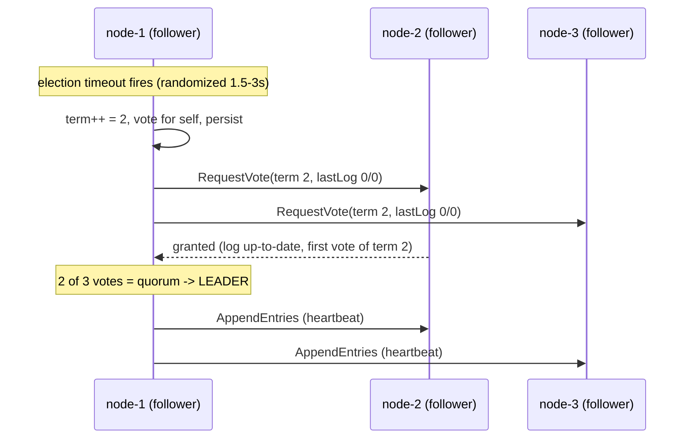
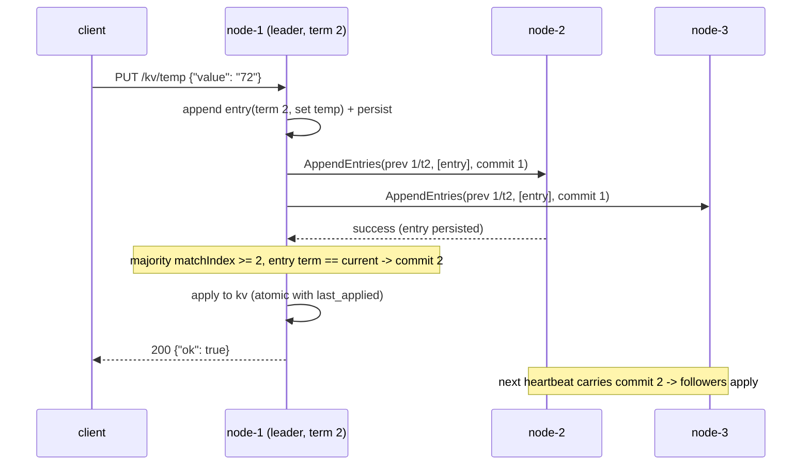
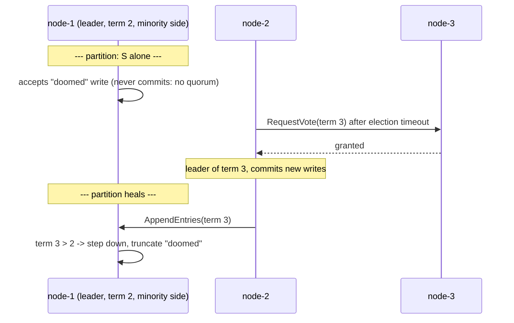

# Raft, in plain language

Raft keeps several machines agreeing on one ordered list of commands — the
**replicated log** — so that each machine, applying that list in order, ends up with
the same state. It splits the problem into leader election and log replication.

**Terms are logical clocks.** Time is divided into numbered terms; each term has at
most one leader. Nodes stamp every message with their term. A node that sees a higher
term than its own knows its information is stale and immediately becomes a follower of
that newer term. Terms are how a cluster with no shared clock still agrees on "before"
and "after".

**Roles.** Every node is a **follower** (passive: answers RPCs, waits for heartbeats),
a **candidate** (its election timer fired: it increments the term and asks for votes),
or the **leader** (sends heartbeats, accepts client writes, replicates them). There is
no configuration — roles emerge from timeouts and votes.

**The log.** Each entry holds a client command and the term in which a leader created
it, at a 1-indexed position. Entries start *uncommitted*; once the leader knows a
majority has stored an entry, it is **committed** — at that point it will survive any
minority of failures and is applied to the key-value state machine.

**Quorum.** Every decision — winning an election, committing an entry — requires a
majority (2 of 3 here). Any two majorities overlap in at least one node, so a new
leader is guaranteed to have seen every committed entry: that overlap is the entire
safety argument.

## The seven correctness rules

Each rule is listed with the bug it prevents.

1. **Persist `currentTerm`/`votedFor`/log before replying to any RPC** (Fig. 2,
   §5.2) — prevents a node that crashes and restarts from forgetting its vote and
   voting twice in one term, which would elect two leaders.
2. **Election restriction: grant votes only to candidates whose (lastLogTerm,
   lastLogIndex) is at least as up-to-date** (§5.4.1) — prevents a node that missed
   committed entries from winning and silently overwriting them.
3. **Advance `commitIndex` only via majority matchIndex over current-term entries**
   (§5.4.2, Figure 8) — prevents the Figure-8 bug where a leader counts replicas of an
   old-term entry, declares it committed, and a later leader erases it.
4. **Any RPC request *or response* carrying a higher term → adopt it, reset
   `votedFor`, become follower** (§5.1) — prevents split brain: two nodes both acting
   as leader at once.
5. **AppendEntries consistency check on (prevLogIndex, prevLogTerm); truncate only on
   conflict** (§5.3) — prevents a delayed, reordered AppendEntries from truncating
   entries that already match and un-committing applied state.
6. **One persisted vote per term** (§5.2) — prevents two candidates from both
   assembling a "majority" out of double-voting nodes.
7. **Randomized election timeouts** (§5.2) — prevents livelock where every candidate
   times out in lockstep and split votes repeat forever.

Beyond the seven: the election timer resets *only* on an AppendEntries from the
current leader, on granting a vote, or on starting an election; heartbeats run the full
receiver checks; stale replies are dropped by comparing against the term you sent; and a
deposed leader resets its (stale-from-its-whole-tenure) timer on step-down so it doesn't
instantly re-elect itself.

**"From the current leader" means the term is current — not that the append succeeded.**
The distinction decides a real bug, so it is worth stating rather than leaving to the
reader. A follower whose log has diverged gets its AppendEntries *rejected* by its own
consistency check, for at least one round trip and possibly several while the leader walks
`nextIndex` backwards; the thesis (§3.5) has the leader send entry-less AppendEntries
during exactly that walk, indistinguishable from heartbeats and failing the check by
design. (The §5.3 conflict hint makes that walk short — a couple of round trips rather
than one per missing entry, see [FAILURE_MODES.md](FAILURE_MODES.md) — but it does not
make it empty, and one rejected append is enough for this bug.) Withholding
the timer reset until an append succeeds means that follower times out and deposes a
perfectly healthy leader *while it is being repaired* — the repair then restarts under a
new leader, and a cluster with one lagging node can churn indefinitely.

So `handle_append_entries` resets the timer, and records `leader_id`, **before** running
the consistency check, and only a stale *term* skips the reset. etcd does the same, in the
same order (`raft.go`, `stepFollower`: `r.electionElapsed = 0; r.lead = m.From;
r.handleAppendEntries(m)`). Getting this wrong is a liveness failure, not a safety one —
no committed entry is ever lost by it — which is why it survives casual testing and shows
up only as unexplained leader churn. Pinned by
`tests/test_append_entries.py::test_a_failed_consistency_check_still_resets_the_timer`.

## Leader election

## A write, replicated and committed

## Partitioned leader: the safety story

This exact scenario runs, with assertions, in
`tests/test_simulation.py::test_partitioned_leader_cannot_commit_then_steps_down`.
